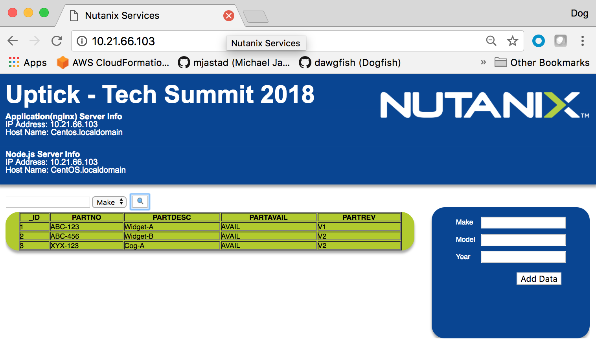

# Uptick Application
The uptick application is designed to be used as a boiler plate for provisioning infrastructure, and application deployment and devlopment.  The application supports both MSSQL, and Mongoose databases, with extensions for PGSQL, and MySQL...



## Application State
Currently the app will pull data from a target database and render it to a web-client.  Instrumentation is in place for SE's to add their own development for:

* Add/Search Data by:
  * ***Make***
  * ***Model***
  * ***Year***
* Multiple Database(s)

## Requirements
* CentOS v7
* NGINX for CentOS v7
* node.js v9.x.x
  * mssql ODB driver v3.3.0
  * express
* Database
  * MSSQL (2008, 2012, 2014, 2016)
  * Mongoose

## Setup & Configuration

### Multi Node

  [BROWSER/CLIENT] <--HTTP--> [NGINX-SERVER] <--REST--> [NODE-SERVER] <--ODBC Protocol--> [DB-SERVER]
  
* Create 2x CentOS v7 Guest VMs
  * Install NGINX on Guest VM #1
  * Install node.js v9.x on Guest VM #2
  
### Single Node

  [BROWSER/CLIENT] <--HTTP--> [NGINX + NODE SERVER] <--ODBC Protocol--> [DB-SERVER]

* Create a CentOS v7 Guest VM
  * Install NGINX 
  * Install node.js

## Infrastructure
Configuring software needed for application deployment(s)...

### References
* [Installing NGINX on CentOS v7](https://www.digitalocean.com/community/tutorials/how-to-install-nginx-on-centos-7)
* [Installing node on CentOS v7](https://www.rosehosting.com/blog/how-to-install-node-js-and-npm-on-centos-7)
* [Enabling/Disabling SE Linux on CentOS v7](https://www.tecmint.com/disable-selinux-temporarily-permanently-in-centos-rhel-fedora/)
* [Installing Mongoose on CentOS v7](https://www.howtoforge.com/tutorial/how-to-install-and-configure-mongodb-on-centos-7/)

## Setup and Configuring Application
### Install software:
* Multi Node: 
  * Install software to a working directory on the server configured with Node v9.x
  * *Node v9.x Server*
    * /routes
    * /models
    * /js
    * /config
    * server.js
    * package.json
    * Insure files (including full path) have drwxr..xr..x (755) privileges.
  * *NGINX Server*
    * /var/www/html/index.html
    * /var/www/html/fonts
    * /var/www/html/css
    * /var/www/html/images
    * Insure files (including full path) have **drwxr..xr..x** (755) privileges.
* **Single Node:** 
  * Install software to */var/www/html* on the server where NGINX + Node v9.x is installed
  * Insure files (including full path) have **drwxr..xr..x** (755) privileges.
  * Check to make sure SE Linux is not obfiscating path resolution (see SE Linux references above).

```
% chmod -R 755 /var/www/html/*

```

* Build the node runtime for the project - this adds the required libs to the node runtime.

```
% npm build [/node software directory]/package.json

```
* Modify IP Address in **js/data.js** file

```
var url = "http://IP-ADDDRESS:3000/api/";
```
* Modify MSSQL database connection information in the *config/config.rst* file as follows:

```
module.exports = {
  connConfig: {
    server: 'DB SERVER IP-ADDRESS',
    database: 'DATABASE NAME',
    user: 'SQL AGENT (i.e. 'sa')',
    password: 'DB USER PASSWORD',
    port: 'DB PORT'
  }
};

```
* Start server

```
% node /var/www/html/server.js

```

* Once the server is started, point web-browser to the NGINX SERVER IP Address and click the serach icon to populate and render the data table...

### Supported Functions
* Search for data in the application
* Add data in the application

