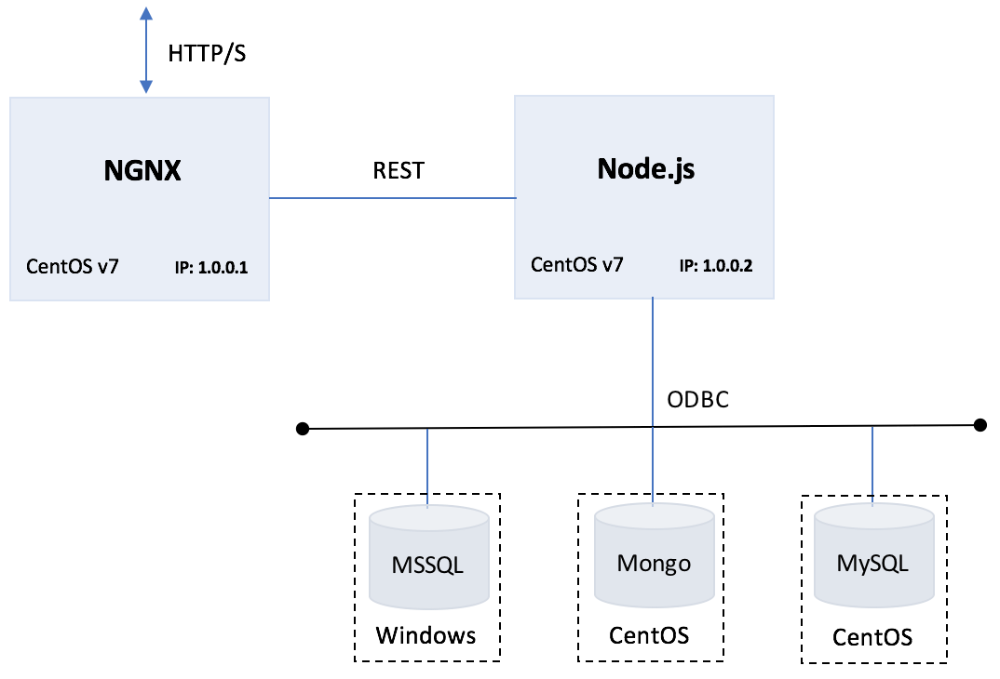
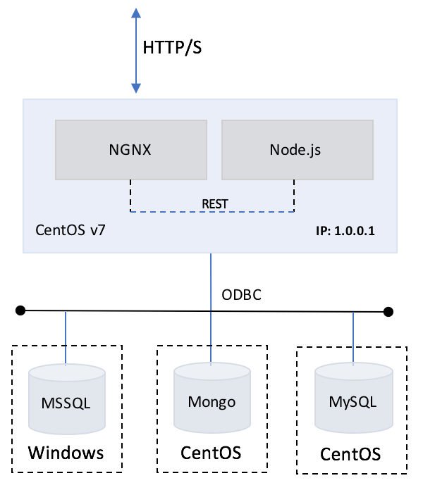

# Uptick Application
The uptick application is designed to be used as a boiler plate for provisioning infrastructure, and application deployment and development.  The application is architected using a Node.js server coupled with NGINX deployed as a proxy to allow for horizontal scaling. The application also provides back-end database support for MSSQL, MySQL, PGSQL, and Mongo.


## Requirements
* CentOS v7
* Git
* NGINX for CentOS v7
* Node.js v9.x.x
  * mssql ODB driver v3.3.0
  * express 4.16.2
  * mysql 2.15.0
  * mongo 0.1.0
* Database Instances
  * MSSQL (2008, 2012, 2014, 2016)
  * Mongo 4.x
  * MySQL 5.x
  * PGSQL 9.x
  
### Node.js
Node.js is an open source Javascript runtime environment used to simplify instrumenting server-side and networking applications. The platform runs on Linux, OS X, FreeBSD, and Windows, and its applications are written in JavaScript. Node.js applications can be run at the command line. You can also configure Node to run them as a service, so that the application automatically restarts on reboot or failure - as if you were in a production environment.

### NGINX
Nginx [engine x] is an HTTP and reverse proxy server, a mail proxy server, and a generic TCP/UDP proxy server.  The Uptick application utilizes NGINX as a web-server.  Nginx can be deployed to serve dynamic HTTP content on the network using FastCGI, SCGI handlers for scripts, WSGI application servers or Phusion Passenger modules, and it can serve as a software load balancer.  Nginx uses an asynchronous event-driven approach to handling requests. Nginx's modular event-driven architecture can provide more predictable performance under high loads.

### MS SQL Server
Microsoft SQL Server is a relational database management system developed by Microsoft. As a database server, it is a software product with the primary function of storing and retrieving data as requested by other software applications—which may run either on the same computer or on another computer across a network (including the Internet).

### Mongo
MongoDB is an open-source cross-platform document-oriented database program. Classified as a NoSQL database program, MongoDB uses JSON-like documents with schemas. 

### MySQL
MySQL is an open-source relational database management system (RDBMS).  MySQL's core engine is written in C and C++. coupled with a yacc parser and proprietary lexical analyzer for supporting SQL.

### PostgreSQL
PostgreSQL is an object-relational database management system (ORDBMS) with an emphasis on extensibility and standards compliance. As a database server, its primary functions are to store data securely and return that data in response to requests from other software applications.

## Setup & Configuration

### Multi Node
Node-clusters are good for taking advantage of multi core processors, but when it comes to horizontal scaling(adding more virtual machines), you'll need to use load balancers or reverse proxy. In most cases application developers can use any web server such as Apache or NGINX as a reverse proxy. for this application architecture Uptick uses NGINX as a web server.



To setup a Multi Node deployment you'll need to perform the following:
  
* Create 2 CentOS v7 Guest VMs
  * 2 vCPU
  * 1 Core/vCPU
  * VLAN
  * 20GB Storage
* Install NGINX on Guest VM #1
* Install Node.js v9.x on Guest VM #2
* Check to make sure SE Linux is not obfuscating path resolution (see SE Linux references).
* Check to make sure Firewalls are configured to allow port resolution. 

Install the Application Software to a working directory on the servers as follows:

Create a working directory for you Uptick application software on the Node.js Server
```
$ mkdir /var/www/projects/uptick
```

Change to the directory just created and use *git* to clone the *Uptick* repository (application + database files) to the Node v9.x Server
```
$ cd /var/www/projects/uptick
$ git clone https://github.com/mjastad/uptick.git
```

Distribute the files across the servers as indicated below:

* *Node v9.x Server*
  * /routes
  * /models
  * /js
  * /config
  * /databases
  * server.js
  * package.json
  * Insure files (including full path) have drwxr..xr..x (755) privileges.
* *NGINX Server*
  * /var/www/html/index.html
  * /var/www/html/fonts
  * /var/www/html/css
  * /var/www/html/images
  * Insure files (including full path) have **drwxr..xr..x** (755) privileges.
  
```
$ chmod -R 755 /var/www/html/*
```

### Single Node
Single node deployments are simple and easy to manage.  In most cases, multiple copies of a node server are required to deliver performance under heavy workloads. Single node servers can be configured, containerized, and scaled out as needed to support peak operations. 



To setup a Single Node deployment you'll need to perform the following:
  
* Create 1 CentOS v7 Guest VM
  * 2 vCPU
  * 1 Core/vCPU
  * VLAN
  * 20GB Storage
* Install NGINX
* Install Node.js v9.x
* Install all Application Software to */var/www/html* on the server (see steps below).
* Insure files (including full path) have **drwxr..xr..x** (755) privileges.
```
$ chmod -R 755 /var/www/html/*
```
* Check to make sure SE Linux is not obfuscating path resolution (see SE Linux references).
* Check to make sure Firewalls are configured to allow port resolution. 

Install the Application Software to the working directory */var/www/html* on the **NGINX + Node.js** server as follows:

Change to the directory */var/www/html* and use *git* to capture the *Uptick* repository distribution (application + database files) to the Node v9.x Server
```
$ cd /var/www/html/
$ git clone https://github.com/mjastad/uptick.git
```

## Node Package(s)
Node.js incorporates a package manager called NPM used to install and manage Node.js modules within the node.js environment.  NPM is similar to *yum* or *apt-get* on CentOS or Ubuntu respectively.  Node.js modules can be scoped globally or to specific projects for better isolation. change-management, and version control. When NPM installs modules pinned for a given project, it creates a folder named *"node_modules"*, where modules will be placed. All modules installed in the future for a given project will be placed in this folder.

NPM can also generate a build-manifest named *package.json* for a specified project, where it can be used later to build a projects runtime.  The Uptick application uses a *package.json* to recreate the applications runtime dependencies and is included as part of the application software. 

* Build the Node.js runtime for the Uptick project. The *package.json* should be in the root directory where you installed the application software (i.e. /var/www/html/).  Running the command below will build the Uptick Application's runtime.

#### Multi Node
```
$ cd /var/www/projects/uptick
$ npm build package.json
```

#### Single Node
```
$ cd /var/www/html
$ npm build package.json
```

## Application
There are several configuration files that need to be edited to manage data and control-flow between the client and the back-end database.  These files are located in the *config* and *js* directories:

* **config/dbConfig.js** - Manages the supported database types: *mongo, mysql, mssql, pgsql*.  This binds the proper database router for connecting/communicating to the target database.
* **config/mongoConfig.js** - Configures the IP address of the target mongo database server
* **config/mssqlConfig.js** - Configures the IP address, port, and authentication credentials for connecting to the target mssql database server.
* **config/mysqlConfig.js** - Configures the IP address, port, and authentication credentials for connecting to the target mysql database server.
* **js/data.js** - Configures the IP Address for the REST API between the NGINX instance and the Node.js instance.

Modify the *url*: IP-ADDRESS in the **js/data.js** file to correspond to the IP address where the node *server.js* is running/installed.

```
var url = "http://NODE_SERVER_IP_ADDDRESS:3000/api/";
```

## Database
As previously mentioned the Uptick application supports several databases.  Configuration files to manage the connection will need to be edited with the appropriate configuration data to successfully communicate with he back-end database.

### Database Type
Modify Database Type configuration in the *config/dbConfig.rst* file as follows:

```
module.exports = {
  database: {
    //valid databases types: mysql, mssql, mongo
    type: 'mongo'
  }
};
```

The supported database types are: *mongo, mysql, mssql, and pgsql*.

### MS SQL Database
Modify MSSQL database connection information in the *config/mssqlConfig.rst* file as follows:

```
module.exports = {
  connConfig: {
    server: 'DB SERVER IPADDRESS',
    database: 'DATABASE NAME',
    user: 'SQL AGENT (i.e. 'sa')',
    password: 'DB USER PASSWORD' (i.e. same as Administrator),
    port: 'DB PORT' (i.e. 1433 default port)
  }
};
```

### MySQL Database
Modify MySQL database connection information in the *config/mysqlConfig.rst* file as follows:

```
var mysqlConnection = mysql.createConnection({
   host: "DB SERVER IPADDRESS",
   user: "DB USER",
   password: "DB USER PASSSWORD",
   database: "DATABASE NAME"
});
```

### MongoDB Database
Modify the MongoDB database connection information in the *config/mongolConfig.rst* file as follows:

```
module.exports = {
  host: {
    //server url hosting mongoDB 
    url: 'mongodb://DB SERVER IPADDRESS:PORT' (i.e. 27017 default port)
  }
};
```

## Running the Server
Start server

```
% cd /var/www/html
% node server.js
```

Once the server is started, point web-browser to the NGINX SERVER IP Address and click the *Search* button to read data from the database, populate and render the data table in the browser application...

### Supported Functions
* Search for data in the application
* Add data in the application

## Database Setup & Configuration
This section describes how to setup and configure an Uptick backend database.  The database should match the Uptick Applications configuration (i.e database-type, database-router). 

The *Uptick* database images are in the */databases* folder.  

### MongoDB
Configure a MongoDB database instance on a CentOS v7 Guest VM.  Insure that the database is accessible from remote clients.

Edit your MongoDB config file to allow remote access from any remote client: by editing the *mongod.conf* file:
```
$ sudo vi /etc/mongod.conf
```

Look for the **net** line and comment out the **bindIp** line under it, which is currently limiting MongoDB connections to *localhost:*
```
# network interfaces
net:
  port: 27017
#  bindIp: 127.0.0.1  <------ comment out this line
```

**Warning:** In a production environment admins should **NOT** comment out the *bindIp* line without enabling authorization to avoid unfettered *admin* access to all mongo databases on your MongoDB server!

Download the MongoDB version of the *Uptick* database (i.e. found in the uptick repository) https://github.com/mjastad/uptick/tree/master/databases/mongo

Create directory */uptick/database/mongo/*, copy the *uptick.mongodb.data.tar* file to the new directory.
```
$ mkdir /uptick/database/mongo/
$ cd /uptick/database/mongo/
```

Extract the tar file

```
$ tar -xvf uptick.mongodb.data.tar
```

Import the *Uptick* database directory using the restore command.
```
$ cd /uptick/database/mongo/uptick.mongodb.data
$ mongorestore -d Uptick Uptick
```

Restart mongodb
```
$ sudo systemctl restart mongod
```

Test the database by starting a mongoDB shell
```
$ mongo
```

Display all the *documents* in the *parts* collection by running the following command
```
> db.parts.find();
```

### MySQL
Configure a MySQL database instance on a CentOS v7 Guest VM.  Insure that the database has a 'root' user and password, and is accessible by remote clients.

Once MySQL is installed, Set the root user password:
```
$ mysqladmin -u root password nutanix/4u
```

Login to the mysql server and enter the new password when prompted;
```
$ mysql -u root -p
```

Create an empty database:
```
mysql> create database Uptick;     <------- creates an empty database

Output
Query OK, 1 row affected (0.00 sec)
```

Grant a remote *root* user access and specify from any host using (%) as show below:
```                                         
mysql> GRANT ALL ON Uptick.* TO 'root'@'%' IDENTIFIED BY ‘nutanix/4u';   
mysql> FLUSH PRIVILEGES;
```
**NOTE:** The user created above should be *root* user and *password* from where you're running the Node Server.

**OPTIONAL:** Restrict remote user access from a specified host to harden security.
```
mysql> GRANT ALL ON Uptick.* TO 'root'@'remotehost-ipaddress' IDENTIFIED BY ‘nutanix/4u'; 
```

Verify or show a listing of new created users:
```
mysql> select Host, User, Password from mysql.user;
+--------------+-----------+-------------------------------------------+
| Host         | User      | Password                                  |
+--------------+-----------+-------------------------------------------+
| localhost    | root      | *8CD8DA5B27F8FE8E1910C36EFB9B5936888E141C |
| 127.0.0.1    | root      |                                           |
| ::1          | root      |                                           |
| 10.21.19.101 | root      | *8CD8DA5B27F8FE8E1910C36EFB9B5936888E141C |
| 10.21.19.103 | root      | *8CD8DA5B27F8FE8E1910C36EFB9B5936888E141C |
+--------------+-----------+-------------------------------------------+
6 rows in set (0.00 sec)
```

Exit MySQL by pressing *CNTRL-D*. 

Download the MySQL version of the *Uptick* database (i.e found in the uptick repository) https://github.com/mjastad/uptick/tree/master/databases/mysql

**NOTE:** Using *git clone* is the proper way to download the database instances... 

Create diretory */uptick/database/mysql*,  and copy the *../databases/mysql/uptick.database.sql* file to the new directory.
```
$ mkdir /uptick/database/mysql
$ cd /uptick/database/mysql        <------ copy uptick.database.sql to this directory
```

Using the command-line, import the *Uptick* database file: *uptick.database.sql* using file-redirection.
```
$ mysql -u username -p Uptick < uptick.database.sql
```

Login to the mysql server and enter the new password when prompted;
```
$ mysql -u root -p
```

Verify the database:
```
mysql> use Uptick;
Reading table information for completion of table and column names
You can turn off this feature to get a quicker startup with -A

Database changed
mysql> show tables;
+------------------+
| Tables_in_Uptick |
+------------------+
| Make             |
| ModelToPart      |
| Parts            |
+------------------+
3 rows in set (0.00 sec)

mysql>
```

Exit MySQL by pressing *CNTRL-D*. 

Restart MySQL
```
$ sudo systemctl restart mysqld
```

### MS SQL Server
The MS SQL Server database instance is created from the *NTNX xtract* process.

### PostgreSSQL
PostgreSQL support is currently under development. 

### References
* [Installing NGINX on CentOS v7](https://www.digitalocean.com/community/tutorials/how-to-install-nginx-on-centos-7)
* [Installing node on CentOS v7](https://www.rosehosting.com/blog/how-to-install-node-js-and-npm-on-centos-7)
* [Enabling/Disabling SE Linux on CentOS v7](https://www.tecmint.com/disable-selinux-temporarily-permanently-in-centos-rhel-fedora/)
* [Installing Mongoose on CentOS v7](https://www.howtoforge.com/tutorial/how-to-install-and-configure-mongodb-on-centos-7/)
* [Installing MongoDB on CentOS v7](https://www.digitalocean.com/community/tutorials/how-to-install-mongodb-on-centos-7)
* [Installing MySQL Database on CentOS v7](https://www.digitalocean.com/community/tutorials/how-to-install-mysql-on-centos-7)
* [Import & Exporting MySQL Databases](https://www.digitalocean.com/community/tutorials/how-to-import-and-export-databases-in-mysql-or-mariadb)
