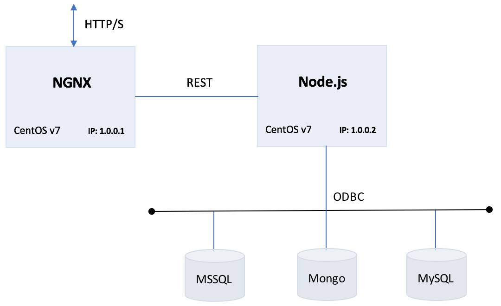

# Uptick Application
The uptick application is designed to be used as a boiler plate for provisioning infrastructure, and application deployment and devlopment.  The application is architected using a Node.js server coupled with NGINX deployed as a proxy to allow for horizontal scaling. The application also provides back-end database support including; MSSQL,MySQL, PGSQL, and Mongo.

## Node.js
Node.js is an open source Javascript runtime environment used to simplify instrumentating server-side and networking applications. The platform runs on Linux, OS X, FreeBSD, and Windows, and its applications are written in JavaScript. Node.js applications can be run at the command line. You can also configured Node to run them as a service, so that the application automatically restarts on reboot or failure - as if you were in a production environment.

## NGINX

Nginx [engine x] is an HTTP and reverse proxy server, a mail proxy server, and a generic TCP/UDP proxy server.  The Uptick applicatioin utilizes NGINX as a reverse proxy.  Nginx can be deployed to serve dynamic HTTP content on the network using FastCGI, SCGI handlers for scripts, WSGI application servers or Phusion Passenger modules, and it can serve as a software load balancer.  Nginx uses an asynchronous event-driven approach to handling requests. Nginx's modular event-driven architecture can provide more predictable performance under high loads.


## Requirements
* CentOS v7
* NGINX for CentOS v7
* node.js v9.x.x
  * mssql ODB driver v3.3.0
  * express 4.16.2
  * mysql 2.15.0
  * mongo 0.1.0
* Database Instances
  * MSSQL (2008, 2012, 2014, 2016)
  * Mongo 4.x
  * MySQL 5.x
  * PGSQL 9.x

### Mongo

MongoDB is a free and open-source cross-platform document-oriented database program. Classified as a NoSQL database program, MongoDB uses JSON-like documents with schemas. 

### MySQL

MySQL is an open-source relational database management system (RDBMS).  MySQL is written in C and C++. Its SQL parser is written in yacc, but it uses a home-brewed lexical analyzer.

### PostgreSQL

PostgreSQL, simply Postgres, is an object-relational database management system (ORDBMS) with an emphasis on extensibility and standards compliance. As a database server, its primary functions are to store data securely and return that data in response to requests from other software applications.

## Setup & Configuration

### Multi Node

Node-cluster is good for taking advantage of multi core processors, but when it comes to horizontal scaling(adding more virtual machines), you'll need to use load balancers or reverse proxy. For reverse proxy you can use any web server like Apache or nginx. In this architecture we use nginx.



[BROWSER/CLIENT] <--HTTP--> [NGINX-SERVER] <--REST--> [NODE-SERVER] <--ODBC Protocol--> [DB-SERVER]
  
* Create 2x CentOS v7 Guest VMs
  * Install NGINX on Guest VM #1
  * Install node.js v9.x on Guest VM #2
  
### Single Node


[BROWSER/CLIENT] <--HTTP--> [NGINX + NODE SERVER] <--ODBC Protocol--> [DB-SERVER]

* Create a CentOS v7 Guest VM
  * Install NGINX 
  * Install node.js

## Infrastructure
Configuring software needed for application deployment(s)...

### References
* [Installing NGINX on CentOS v7](https://www.digitalocean.com/community/tutorials/how-to-install-nginx-on-centos-7)
* [Installing node on CentOS v7](https://www.rosehosting.com/blog/how-to-install-node-js-and-npm-on-centos-7)
* [Enabling/Disabling SE Linux on CentOS v7](https://www.tecmint.com/disable-selinux-temporarily-permanently-in-centos-rhel-fedora/)
* [Installing Mongoose on CentOS v7](https://www.howtoforge.com/tutorial/how-to-install-and-configure-mongodb-on-centos-7/)

## Setup and Configuring Application
### Install software:
* Multi Node: 
  * Install software to a working directory on the server configured with Node v9.x
  * *Node v9.x Server*
    * /routes
    * /models
    * /js
    * /config
    * server.js
    * package.json
    * Insure files (including full path) have drwxr..xr..x (755) privileges.
  * *NGINX Server*
    * /var/www/html/index.html
    * /var/www/html/fonts
    * /var/www/html/css
    * /var/www/html/images
    * Insure files (including full path) have **drwxr..xr..x** (755) privileges.
* **Single Node:** 
  * Install software to */var/www/html* on the server where NGINX + Node v9.x is installed
  * Insure files (including full path) have **drwxr..xr..x** (755) privileges.
  * Check to make sure SE Linux is not obfiscating path resolution (see SE Linux references above).

```
% chmod -R 755 /var/www/html/*

```

* Build the node runtime for the project - this adds the required libs to the node runtime.

```
% npm build [/node software directory]/package.json

```
* Modify IP Address in **js/data.js** file

```
var url = "http://IP-ADDDRESS:3000/api/";
```
* Modify MSSQL database connection information in the *config/config.rst* file as follows:

```
module.exports = {
  connConfig: {
    server: 'DB SERVER IP-ADDRESS',
    database: 'DATABASE NAME',
    user: 'SQL AGENT (i.e. 'sa')',
    password: 'DB USER PASSWORD',
    port: 'DB PORT'
  }
};

```
* Start server

```
% cd /var/www/html
% node server.js

```

* Once the server is started, point web-browser to the NGINX SERVER IP Address and click the serach icon to populate and render the data table...

### Supported Functions
* Search for data in the application
* Add data in the application

